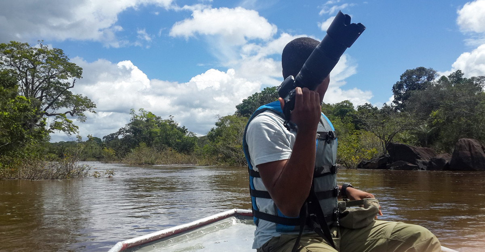

## Photography, Videography, and Writing

<a href = "#photography">Photography</a>
 <a href = "#videography">Videography</a>
 <a href = "#writing">Writing</a>

<figure>

<figcaption><i>Me with my camera on the Essequibo river</i></figcaption>
</figure>

#### Photography

My photography has been featured in local gallery exhibitions, as well as newspaper, and other media (print and online), articles. I have worked as a photographer for many projects and organizations, and my photography has become an important part of my work and skillset.

##### Photography features:

**Exhibitions**:

 - <a href = "http://www.visions.gy/2018/">*VISIONS 2018*</a>
 - <a href = "http://www.visions.gy/2016/">*VISIONS 2016*</a>

**Articles**:

- <a href = "">The trade in seed-finches from the Guianas: Can a diaspora fuel an international trade?</a>. **Trading Ideas**. *Oxford Martin School*, University of Oxford. Oxford, UK.
  - Republished: Bird Racing: Culture & Conservation. *North Carolina Naturalist*: Winter 2019, Vol. 27, No. 1.
- <a href = "https://roadsandkingdoms.com/2017/the-siren-song-of-the-mighty-towa-towa/"> The Siren Song of the Mighty Towa Towa.</a> <i>Roads and Kingdoms</i>: 17th May, 2017.
  - Republished: <a href = "https://explorepartsunknown.com/queens/the-siren-song-of-the-mighty-towa-towa/"> The Siren Song of the Mighty Towa Towa.</a> <i>Explore Parts Unknown</i>: 18th May, 2017. CNN. 
- Suriname: Birds in a changing landscape. <i>North Carolina Naturalist</i>: Spring 2016, Vol. 24, No. 2.

 **<a class="nav-link" href="{{ my_page.url | relative_url }}/portfolio">My portfolio page</a> is still under construction.** For now, please see my <a href = "https://www.instagram.com/meshachpierre/">Instagram page</a>

#### Videography
I have filmed and edited two short documentaries about research and conservation in the Guianas. A few of them are hosted on my <a href = "https://www.youtube.com/channel/UCwerm_WcVUhnuBqDBaROYeA">Youtube channel</a>. They are embedded below:

**Birds in a Changing Forest**
<iframe width="560" height="315" src="https://www.youtube.com/embed/ebaRh_lGWjY" title="YouTube video player" frameborder="0" allow="accelerometer; autoplay; clipboard-write; encrypted-media; gyroscope; picture-in-picture" allowfullscreen></iframe>

**Iwokrama: Celebrating 20 Years**
<iframe width="560" height="315" src="https://www.youtube.com/embed/TaQyYZ_opiw" title="YouTube video player" frameborder="0" allow="accelerometer; autoplay; clipboard-write; encrypted-media; gyroscope; picture-in-picture" allowfullscreen></iframe>

I have also produced various short films, including a short series of videos about the mammals of Guyana for Panthera Guyana. Another video shot in <a href = "https://iwokrama.org/">Iwokrama</a> is hosted on the <a href = "https://www.youtube.com/channel/UCQSsDr3RYfWqK65hLIkddEw">Iwokrama Youtube page</a>:

**Monitoring with Micah Davis-Head ranger at Iwokrama**
<iframe width="560" height="315" src="https://www.youtube.com/embed/_U2tfbmOEU4" title="YouTube video player" frameborder="0" allow="accelerometer; autoplay; clipboard-write; encrypted-media; gyroscope; picture-in-picture" allowfullscreen></iframe>

#### Writing

I maintain a blog, <a href = "http://guianensis.wordpress.com/">Guianensis</a>, that hosts my writing. I have also written articles related to research and mental health for various outlets. 

#### <a href = "http://guianensis.wordpress.com/">Guianensis</a> highlights

 - <a href = "https://guianensis.wordpress.com/2021/06/16/on-labels-being-defined-and-not-being-defined-by-them/">On Labels: Being defined and not being defined by them.</a> 16th June, 2021.
    - What my diagnoses mean to me and how I navigate thinking about myself with them.

 - <a href = "https://guianensis.wordpress.com/2021/06/02/mental-health-the-pandemic-and-guyana-reflections-from-the-open-space-conversation-may-2021/">Mental health, the pandemic and Guyana: Reflections from the open space conversation (May 2021).</a> 2nd June, 2021
    - In May 2021, a friend and I hosted an open space for talking about mental health, wellbeing, and the COVID-19 pandemic. It was well attended, and went on for 2 hrs - an hour longer than planned.

#### Popular media

 - <a href = "https://www.stabroeknews.com/2020/01/26/sunday/the-writers-room/on-anxiety-my-journey-within/">On Anxitey: My Journey Within.</a> Stabroek News: 26th January, 2020.
   - This article I wrote for a Guyanese newspaper in 2020 details my history with getting diagnosed with anxiety, doing therapy, getting prescribed medication, and my reflections on the state of mental health stigma in Guyana.
   

 - <a href = "https://www.illegalwildlifetrade.net/2018/11/22/the-trade-in-seed-finches-from-the-guianas-can-a-diaspora-fuel-an-international-trade/">The trade in seed-finches from the Guianas: Can a diaspora fuel an international trade?.</a> Trading Ideas: 22nd November,2018. Oxford Martin School, University of Oxford. Oxford, UK.
   - This article (co-authored by <a href = "https://naturalsciences.org/staff/brian-oshea">Dr. Brian O'Shea</a>) provides an overview of _bird racing_, a cultural activity found in the Guianas and southern Caribbean. It has been exported to the US and Canada with Guyanese emigration, bringing with it, a valuable wildlife trade.

 - <a href = "https://issuu.com/amsstlucia/docs/explore_guyana_2019-small/60">Iwokrama, The Green Heart of Guyana: Where Images and Stories are Waiting to be Told.</a> Explore Guyana: 2019. Guyana Tourism Authority. Georgetown Guyana.
    - This fun article in the Government of Guyana's Guyana Tourism Authority's official magazine explores the Iwokrama rainforest as a photographer's paradise.

- <a href = "">Guide to the Birds of Iwokrama.</a> Iwokrama International Centre for Rainforest Conservation and Development: 2018. Georgetown, Guyana.
   - This is a short guide to the birds of the Iwokrama forest intended for guests with limited birding experience.