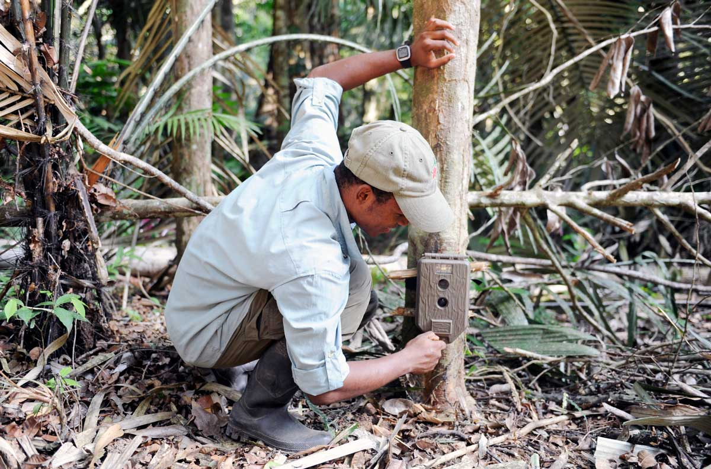
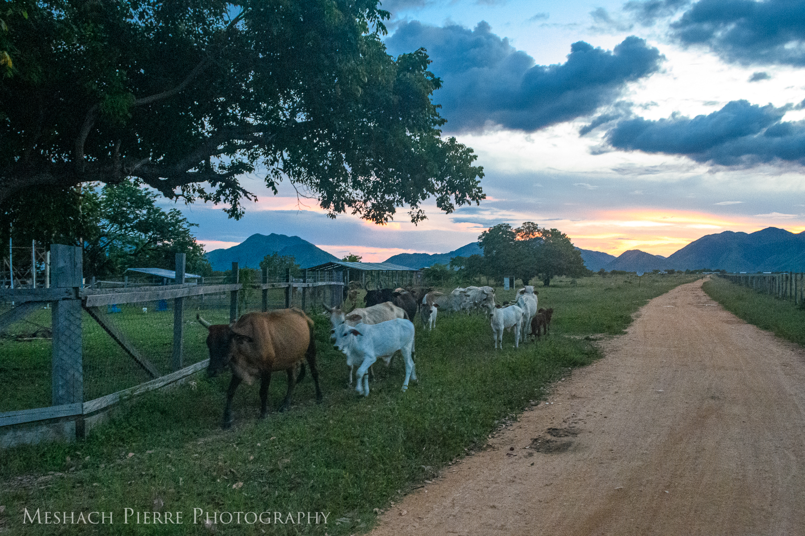
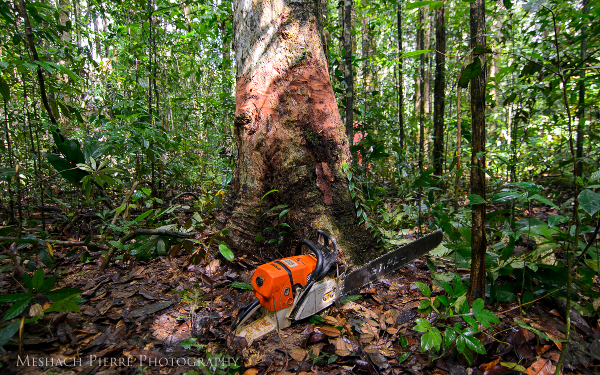
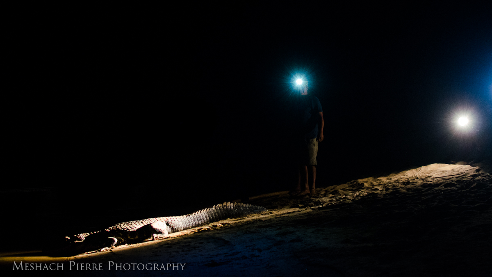
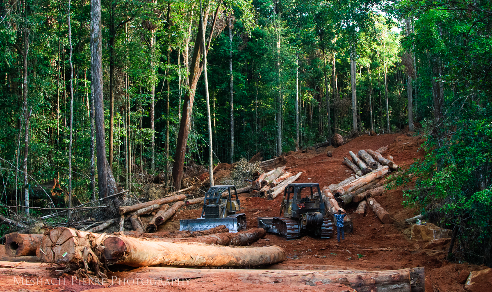
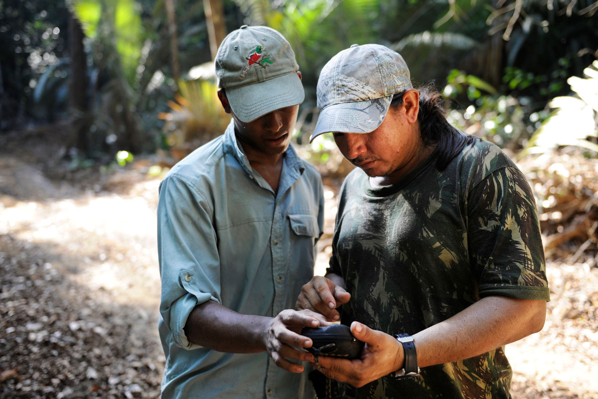

### Research Interests

I am interested in the conservation of wildlife in the Guiana Shield, Caribbean, and Latin America. Broadly, I have the following research interests: bird and large mammal ecology and conservation; and the human dimensions of human-wildlife interactions, including and human-wildlife coexistence and conflict.

I am most interested in applied research that aims to benefit both wildlife and the people who live alongside them. This may range from understanding the effects of land use on wildlife populations, and/or the coexistence of Indigenous communities with wildlife.

As I journey further into the human-dimensions of conservation, I hope to apply mixed-methodological approaches. I also aim to conduct socio-ecological that combines social and ecological datasets to inform conservation decisions. 

### Current Research

##### Master's research (MA Criminology, Law, and Society)

**Committee chair/advisor**: <a href = "https://soccrim.clas.ufl.edu/jessica-kahler/">Dr. Jessica Kahler</a>
 **Co-advisor**: <a href = "https://www.rupununiwildlife.org/">Dr. Matthew Hallett</a>

My current research aims to understand the human-dimensions of human-jaguar coexistence and conflict in the Rupununi region of Guyana. I am applying the interdisciplinary conservation criminology framework to understand risk perceptions, environmental stewardship and guardianship intention towards jaguars and livestock. I am applying criminological and sociological theories and concepts in a new, novel setting: remote, rural, ranches and mostly-Indigenous communities.

This project is part of the Sustainable Wildlife Management Project-Guyana's wider Human-wildlife conflict project led by Dr. Matthew Hallett 

##### Other projects

###### Land-use effects on mammal and ground-bird populations

I am part of a collaborative project that aims to understand the impacts of extractive land use activities (logging, mining, and hunting) on populations of large and medium-bodied mammals and ground birds in Guyana. We are still in the early phases of this project. Please do get in touch if you would like to take part.

### Past research

##### Human-black caiman conflict in the North Rupununi wetlands (2017-2019)

This project (in collaboration with <a href = "https://rupununiwildlife.org/">Dr. Matthew Hallett</a> and <a href = "http://caimanhouse.com/">Caiman House</a>) was the first study of human-black caiman conflict in the Rupununi region of Guyana. We collected survey data on fishing behaviour, attitudes towards and interactions with black caiman (<i>Melanosuchus niger</i>), the largest aquatic predator in South America.

This project served as the final project for my Postgraduate Diploma in International Wildlife Conservation Practice at the Wildlife Conservation Research Unit (WildCRU), University of Oxford. I was supervised by <a href = "https://www.zoo.ox.ac.uk/people/dr-claudio-sillero#/">Prof. Claudio Sillero-Zubiri</a> and <a href = "https://scholar.google.com/citations?user=EVJ010MAAAAJ&hl=fil">Dr. Kim Jacobsen</a>.

We are currently in the process of publishing our results in a peer-reviewed journal. Once they are accepted, they will be disseminated broadly.

##### Jaguar populations in a mixed-land use landscape (2014-2015)

This project formed part of my Panthera Winston Cobb Memorial Fellowship (2014-2015) research. We studied the large-medium bodied mammals of the Siparuni logging concession operated by Demerara Timbers Ltd. (DTL). This concession featured logging, hunting, and mining.

An internal report for this project is available upon request. We are also planning to publish the findings (along with the data and code) in a peer reviewed journal.

##### Biodiversity assessment of the Upper Berbice region, Guyana (2014)

This collaboration between Panthera-Guyana and WWF-Guianas was one of the first activities I undertook as Panthera-Guyana's Winston Cobb Memorial Fellow (2014-2015). We used camera traps and track surveys to document the large-medium mammals of a previously understudied (by Western scientists) forest in the Upper Berbice area. 

The results from this project were published as a chapter in the final report of WWF BAT 3, and in the journal Check List (see below).

### Research Outputs

###### Peer-reviewed

- Fisher J.C., Mistry J., **Pierre M.A.**, Yang H., Harris A., Hunte N., Fernandes D., Bicknell J.E., Davies Z.G. (2021). <a href = "https://rgs-ibg.onlinelibrary.wiley.com/doi/10.1111/geoj.12406">Using participatory video to share people’s experiences of neotropical urban green and blue spaces with decision-makers</a>. *The Geographical Journal* **00**:1-15.
- **Pierre M.A.**, Ignacio L., Paeamelaere E.A.D.P. (2020). <a href = "https://checklist.pensoft.net/article/55247/">Medium- and large-bodied terrestrial mammals of the Upper Berbice region of Guyana</a>. *Check List* **16(5)**: 1229-1237.
- Johnson P., Adams V. M., [and 29 others, including **Pierre M.**] 2019. <a href = "https://www.mdpi.com/2076-2615/9/12/1115/htm">Consequences Matter: Compassion in Conservation Means Caring for Individuals, Populations and Species</a>. *Animals* **9(12)**: 1115.
- Hayes W., Fisher J., **Pierre M.A.**, Bicknell J.E., Davies Z.G. 2019. <a href = "https://onlinelibrary.wiley.com/doi/pdf/10.1111/btp.12729">Bird communities across varying landcover types in a Neotropical City</a>. *Biotropica* **00**:1-14.
- Milensky C. M., Robbins M. B., [and 5 others, including **Pierre M.**] 2016. <a href = "https://www.academia.edu/29183954/Notes_on_breeding_birds_from_the_Guyana_highlands_with_new_records_from_a_recent_inventory_of_Mount_Ayanganna">Notes on Breeding Birds from the Guyana Highlands with New Records from a Recent Inventory of Mount Ayanganna</a>. *Cotinga* **38**: 64–78.

###### Grey and popular literature

- **Pierre M.**, O’Shea B. 2018. <a href = "">The trade in seed-finches from the Guianas: Can a diaspora fuel an international trade?</a>. **Trading Ideas**. *Oxford Martin School*, University of Oxford. Oxford, UK.
- **Pierre M.**, Ignacio L., Torres D., Torres E., and Paemelaere E.A.D. 2018. <a href = "https://www.researchgate.net/publication/340681593_Large_and_Medium_Mammals_of_the_Upper_Berbice_region_Guyana">Large and medium mammals of the upper Berbice region, Guyana</a>. *In* Alonso L.E., Persaud J., and Williams A. (Eds.). <a href = "https://wwflac.awsassets.panda.org/downloads/biodiversity_assessment_survey_of_the_upper_berbice_region_2018.pdf">Biodiversity Assessment Survey of the Upper Berbice Region, Guyana</a>, pp. 100-113. *WWF-Guianas*, Georgetown, Guyana.
- **Pierre M.**, Paemelaere E.A.D.P. 2017. Wildlife Management Assessment Region 9: Upper Takatu–Upper Essequibo, Guyana. Conservation International–Guyana. Georgetown, Guyana. [Internal report]
- Snyder A., and Pierre M., Gomes E., Noonan B. 2016. <a href = "https://www.researchgate.net/publication/319987268_Amphibians_and_Reptiles_of_Kusad_Mountain_and_the_Parabara_Region_in_the_South_Rupununi_Guyana">Amphibians and Reptiles of Kusad Mountain and the Parabara Region in the South Rupununi, Guyana</a>. *In* Alonso L.E., Persaud J., and Williams A. (Eds.). <a href = "https://wwflac.awsassets.panda.org/downloads/wwf_bat_sr_low_res_1.pdf">Biodiversity Assessment Survey of the South Rupununi Savannah, Guyana. BAT Survey Report No. 1</a>. *WWF–Guianas*, Georgetown, Guyana.

## Datasets and code

Please see my <a href = "https://github.com/meshachpierre">GitHub</a> for published datasets and code. The dataset and code for the <a href = "https://checklist.pensoft.net/article/55247/">Upper Berbice Check List paper</a> is stored there, but will be transferred to a long-term repository in future. As I publish more of my work, more data and code will become available.