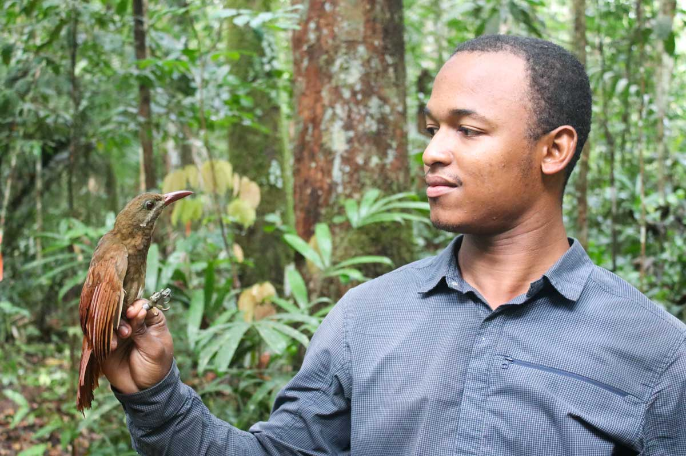
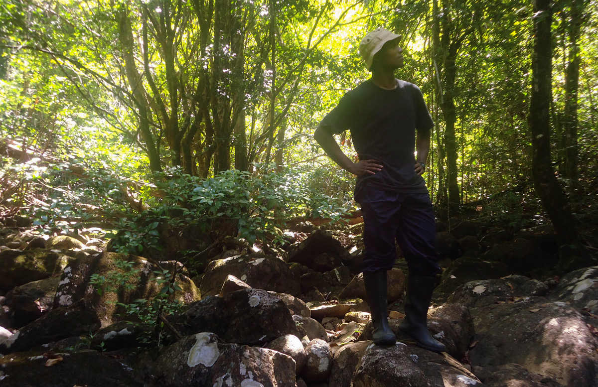
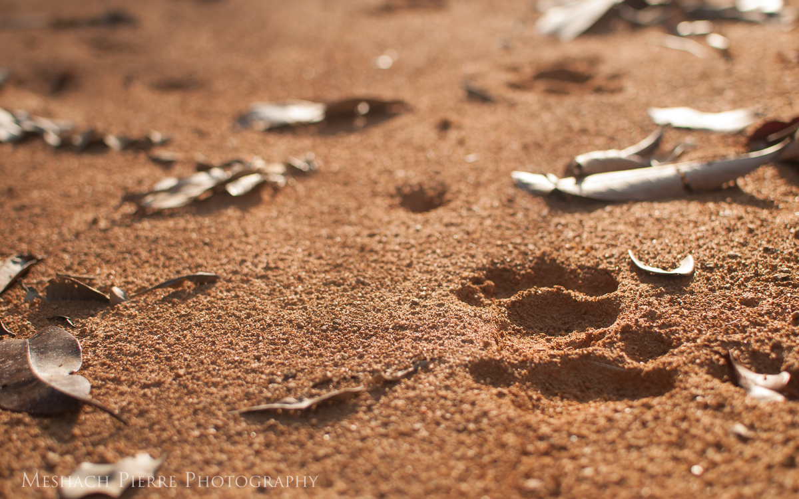
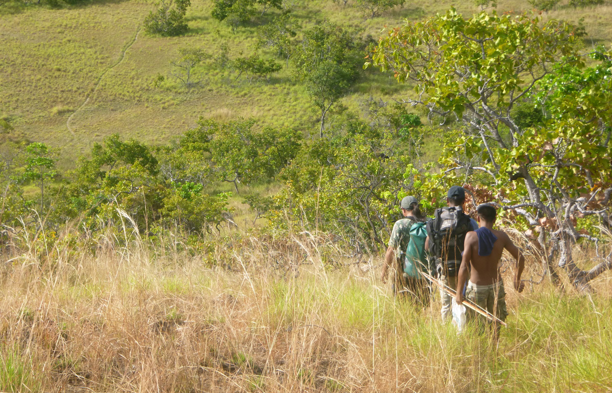
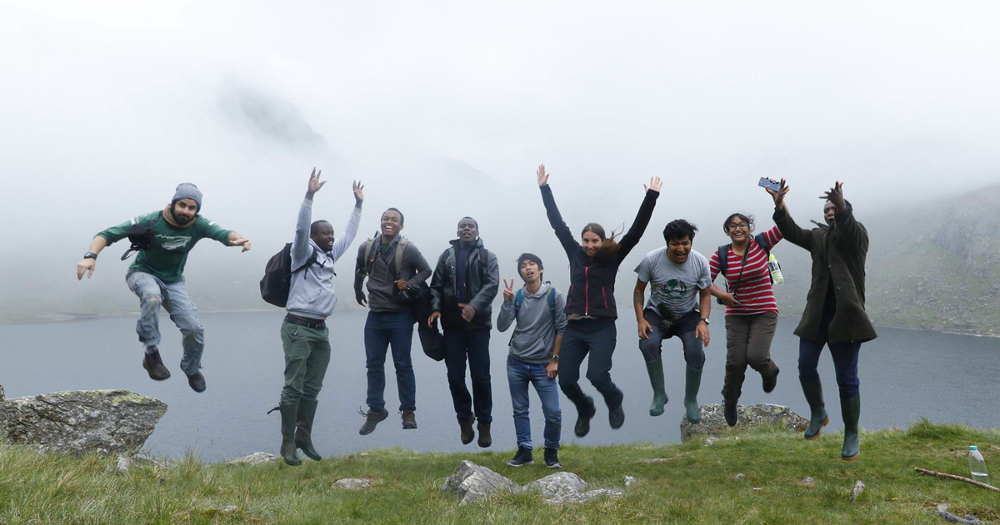
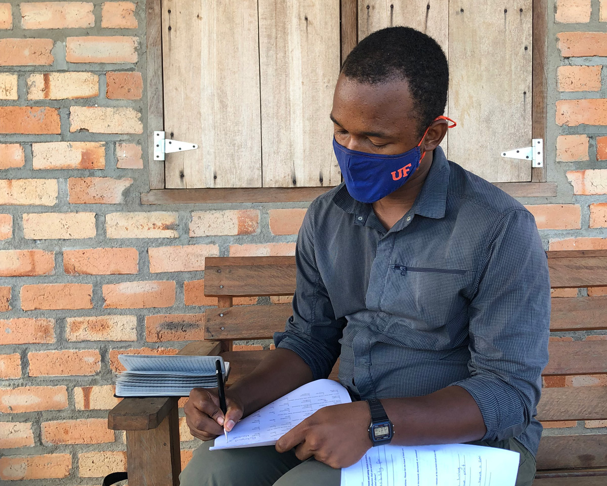
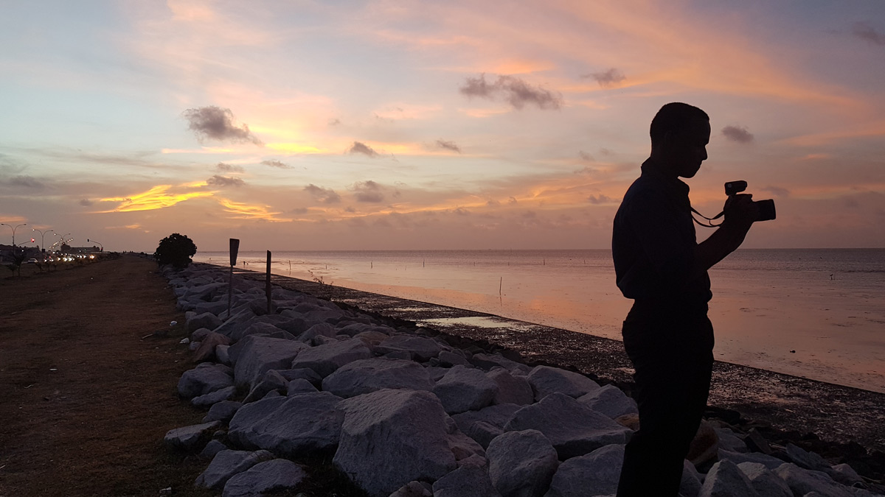
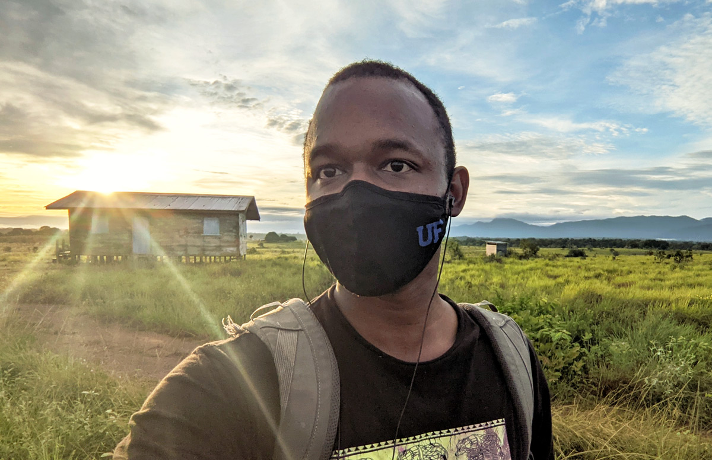

## Overview

<figure>

<text align = "center"><figcaption><i>Handling a red-billed woodcreeper (Hylexetastes perrotii; Photo: © <a href = "https://www.linkedin.com/in/arianne-harris-1b11b9189/?originalSubdomain=gy">Arianne-Elise Harris</a>)</i></figcaption></text>
</figure>

I am from Georgetown, Guyana, and have worked in both Guyana and Suriname, conducting field research on birds, mammals, and most recently, human-wildlife co-existence and conflict.

## My Journey

Although I primarily grew up in Guyana, I have little to no memory of my childhood. My memory mainly begins after I moved to the British Virgin Islands with my family when I was around 7 years old. I did primary school there before moving back to Guyana, 5 years later. I then returned to the school that I left, rejoined my classmates, and continued on to graduate in 2010. I then immediately continued on to the University of Guyana.

My early years in university were not great, academically. I am not a conservationist who started out with a great passion for animals and it was all I ever wanted to do. I initially decided to pursue a degree in Biology with the intention to continue on to doing Medicine. I, however, didn't do particularly well, especially in my first two years, and that never came to be. Instead, I opted to see my degree through to the end, and in my third year, by sheer coincidence, I ended up going to the field for the first time with scientists who were studying manakins. I ended up getting taken particularly by fieldwork and bird research, and later that year went on to the Operation Wallacea (Opwall) Guyana expedition as the first University of Guyana intern, and then as a research assistant to Dr. Andrew Snyder on the World Wildlife Fund - Guianas (WWF-Guianas) Biodiversity Assessment Team (BAT) expedition to the South Rupununi. 

<figure>

<text align = "center"><figcaption><i>Hiking Kusad mountain, South Rupununi (2013)</i></figcaption></text>
</figure>

It was on this expedition that I met people that would go on to become mentors, colleagues, and friends. I kept in touch with Dr. Brian O'Shea of the North Carolina Museum of Natural Sciences, who put me in touch with his colleagues at the Smithsonian Museum of Natural History's Bird Department. They organized (and I accompanied them on) their month-long expedition to Mt. Ayanganna, one of the tallest tepuis (flat-top mountains) found completely within Guyana. I later worked with Brian on the Opwall Guyana project for a few years.  

Dr. Evi Paemelaere, country coordinator for Panthera Guyana, was also on the South Rupununi BAT. I applied with her for Panthera's Liz Claiborne Art Ortenberg Foundation Grant, but we were unsuccessful. Nevertheless, I later got through with Panthera's Winston Cobb Memorial Fellowship, and served as their Winston Cobb Fellow for 2014-2015. Under that project, I studied the responses of jaguars and prey species populations to logging, mining, and hunting, as part of Panthera's overall jaguar corridor initiative, examining the role that human-dominated landscapes played in the persistence of jaguars in South America.

<figure>

<text align = "center"><figcaption><i>A jaguar print on a logging road</i></figcaption></text>
</figure>

After the Panthera Cobb Fellowship, I continued to seek opportunities in Guyana and abroad. I continued to apply for postgraduate programs as well, but funding was a major roadblock. Still, I worked with Brian in Suriname setting up and conducting his bird banding project in the Peperpot Nature Park. I then volunteered for the South Rupununi Conservation Society to develop educational materials for distribution in schools in the communities they worked with. I lived temporarily in the South Rupununi for a couple of months, following the SRCS members on their research and outreach activities, while updating their social media page with the photos I'd taken.

<figure>

<text align = "center"><figcaption><i>Hiking to an SRCS study site</i>></figcaption></text>
</figure>

After this, Evi and I worked with Conservation International-Guyana to develop wildlife-conservation oriented recommendations for the Region 9 Plan of Action for Regional Development (PARD) process. Dr. Matthew Hallett and I also worked together on a grant to study human-black caiman conflict in the Rupununi. At around the same time we were approved for the funding, I was accepted to the University of Oxford's Wildlife Conservation Research Unit (WildCRU) Postgraduate Diploma in International Wildlife Conservation Practice. I went off to live in Tubney for close to a year in 2018 and learned all things conservation while meeting a host of friends, colleagues, sources of inspiration, and mentors. 

<figure>

<text align = "center"><figcaption><i>WildCRU 2018 Panthers at Old Man of Conniston, Lake District, UK</i></figcaption></text>
</figure>

On my way to WildCRU, I took a pit stop in Gainesville, staying with Matt, and meeting various professors, shopping for a potential future advisor. None of the people I met turned out to be my future advisor. While at WildCRU, my final project was the analysis of the black caiman conflict project data. I took on human-wildlife coexistence and conflict as one of my major areas of interest. Matt met and introduced me to Dr. Jessica Kahler, in the department of Criminology, and I made one of the most unexpected left turns in my life history: choosing to do a Master's in Criminology, Law, and Society. And that's where I am now.

<figure>

<text align = "center"><figcaption><i>MA Criminology fieldwork (Photo © Krista Melville)</i></figcaption></text>
</figure>

## Mental health

My mental health is an integral part of who I am and I am open publicly about the conditions I live with, partially because of how big of an issue the stigma surrounding mental illness is in Guyana. I was diagnosed with Generalized Anxiety Disorder (GAD) in 2014, and started therapy and medication. I then did therapy during my time at University of Oxford in 2018. I returned to therapy in Guyana in 2019, where I was diagnosed with Major Depressive Disorder (MDD) and Attention Deficit/Hyperactivity Disorder (ADHD). At the University of Florida (UF) I took a comprehensive mental evaluation which resulted in the same conclusions, albeit a bit more nuanced: GAD, MDD, and ADHD - Combined Presentation (ADHD-C). I currently take medication and do therapy for the three. My writing details more of my life and thoughts around living with mental illnesses, being an academic, and generally living a healthy, happy, fulfilling life.

<figure>

<text align = "center"><figcaption><i>Taking photos at the seawall (Georgetown, Guyana; Photo © Joshua Bonie)</i></figcaption></text>
</figure>

## The future

As I write this, I am in the data entry and analysis phase of my Master's research. I aim to graduate by Fall 2022, which is conveniently when the funding for my Master's ends. After then I plan to proceed into an interdisciplinary PhD at the School of Natural Resources and Environment (SNRE) at UF in 2023. 

<figure>

<text align = "center"><figcaption><i>MA Criminology fieldwork</i></figcaption></text>
</figure>

What happens after? That's anyone's guess. I have thoughts but nothing concrete. Regardless of wherever I end up, and what I end up doing, I aim to continue doing applied research in Guyana and using my findings to advocate for policy recommendations and changes. This is an ideal scenario, and I am open to what the world brings my way, but at some point I'd like to continue doing research in Guyana and the wider Caribbean.